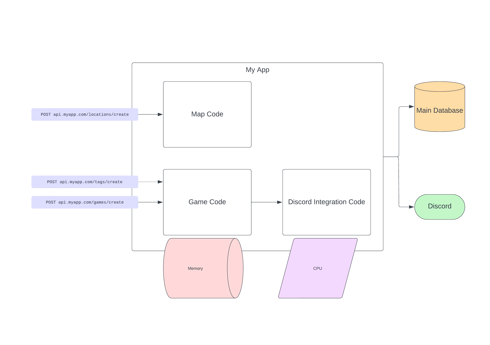

<!-- START doctoc generated TOC please keep comment here to allow auto update -->
<!-- DON'T EDIT THIS SECTION, INSTEAD RE-RUN doctoc TO UPDATE -->

- [Announcements](#announcements)
- [Scaling and Performance in General](#scaling-and-performance-in-general)
- [Scaling with Services](#scaling-with-services)
  - [Vertical Scaling](#vertical-scaling)
  - [Horizontal Scaling](#horizontal-scaling)
  - [Horizontal Scaling plus Performance Services](#horizontal-scaling-plus-performance-services)
  - [Services without Load Balancing](#services-without-load-balancing)
- [Communicating Between Services](#communicating-between-services)
  - [REST](#rest)
  - [Message Queue](#message-queue)
  - [RPC](#rpc)
- [On Load Balancers](#on-load-balancers)
- [Demo: Using a Message Queue to Do Work](#demo-using-a-message-queue-to-do-work)
- [Reading](#reading)

<!-- END doctoc generated TOC please keep comment here to allow auto update -->

## Announcements

- Assignment 1 is due **tomorrow**; share the repo with `hhenrichsen` on GitHub,
  and submit the link to Learning Suite.
- [HackUSU](https://www.hackusu.com/) is coming up early next month; it's a good
  opportunity to continue working on what you've been working on, and meet other
  SWEs (and business students) in Utah.
- Lucid and the Utah Java Users Group is having an event today about
  [Design Tradeoffs in Modern Architectures](https://www.meetup.com/utah-java-users-group/events/296259318/)
  that may be interesting to you all.
- Lucid is having a tech talk about building public APIs and developer platforms
  on February 28th in TMCB 1170 at 6:00pm. Food and drink will be provided:

> Come hear about the technical challenges of building APIs at scale. Lucid
> Software launched their Developer Platform last fall, allowing developers to
> build out custom functionality on Lucid's visual collaboration suite. We now
> need to consider how to write code that is easy to use internally, and great
> for external developers to build on top of. Whether it's taking data from an
> external system to show that in Lucidchart, building out automation in
> Lucidspark, or many other use-cases we are actively improving what we can
> support with our APIs. After diving into some of the deeper technical
> challenges of building out APIs, we'll end with perspectives from an engineer
> who transitioned into product management, who helped lead the success of our
> API launch.

## Scaling and Performance in General

Before we jump into _anything_ else, I want to be clear – these are all scaling
techniques, but you may not need any of the techniques that I'm going to talk
about. These are tools I think can be useful in your toolbox for if you do run
into scaling problems, and a rough overview of them at that.

Scaling is the idea that as more users use your site, you will need more
resources in order to handle those users in a performant way. I'm going to go
over two approaches that we've already touched loosely on: today, we'll talk
about Services, and next time we'll talk about Sharding.

## Scaling with Services

Microservices have somewhat taken over the idea of services, but I want to focus
on a simpler idea here: if you are struggling to deal with load, and there is a
portion of your app that can work independently, make that portion of the app
work independently.

Note: _Diagrams can be viewed independently
[here](https://lucid.app/documents/view/3504a951-b52d-4eee-a971-d4a88e64e11b)._

**Problem:** I have too many users, and my site can't keep up anymore!

Here's an example of the app that we're working with:

### Vertical Scaling

**Solution 1:** Give my site more resources.

**Benefits:**

- Very easy to implement: pay for more resources or add more resources to the
  device running the server.
- Very easy to maintain: no additional servers or configuration needed.

**Drawbacks:**

- Single point of failure: if load exceeds my ability to handle it, or my server
  otherwise goes down, my entire app is down.
- Hardware has limits: you can only get a CPU so fast, and only so many memory
  slots exist on a server.

### Horizontal Scaling

**Solution 2:** Create multiple servers, and balance requests between them.

- Fewer bottlenecks or points of failure: if one server goes down, performance
  may be degraded but your service not entirely unusable.
- Additional servers means they can be placed nearer to users, giving them lower
  latency.

**Drawbacks:**

- Harder to implement and maintain: need at least one extra server, or to pay
  for a platform as a service.
- Higher cognitive load: there are more moving parts, and more configuration
  that must be done.

Revisiting that second benefit, if I have closer servers I can pick those by
using smarter routing:

### Horizontal Scaling plus Performance Services

**Solution 3:** Solution 2, but also isolate performance-critical,
frequently-used, or resource-intensive areas of code to their own services and
servers.

**Benefit:** Resources are used more effectively and parts of the system can
fail independently while still allowing some functionality.

**Drawback:** Additional complexity and cognitive load in implementation and
code sharing; need service to service communication and authentication.

### Services without Load Balancing

**Solution 4:** Isolate performance critical, frequently-used, or
resource-intensive areas of code to their own services without load balancing.

**Benefit**: Critical tasks are isolated and can be executed independently of
main tasks.

**Drawback**: Additional complexity in implementation; need to implement service
communication and configure services to talk to each other.

## Communicating Between Services

Services are able to talk to each other so long as they understand how to deal
with each others' requests. There are a couple ways to do this.

### REST

You can send REST requests from a service just like a client can send a REST
request. This type of communication tends to follow naturally from designing
RESTful APIs, especially if they don't drift too much.

### Message Queue

Another popular way to balance work and exchange data between services is a
message queue. Services push info to the queue and other services can consume
the messages to do work. Queues can be used for round-robining tasks, for
pub/sub, or for normal queue usage.

### RPC

RPC, or Remote Procedure Calls, are another way to talk between services. A
popular implementation of this is Google's gRPC. These use a shared schema and
list of procedures and services to communicate in a standard way between servers
and clients.

## On Load Balancers

Something frequently used among scaling operations are load balancers. Load
balancers are useful for distributing work, whether that work is operations on a
database, SMS messages, emails, dealing with HTTP requests, or anything else.

Most technologies that assist with scaling (PaaS, Lambda, Kubernetes, etc.) will
require some sort of ingress configuration. Lambdas will give you a URL to use,
Kubernetes requires a specific configuration, PaaS will vary. Some of the most
frequently used balancers are Nginx and HAProxy. Normally, these look like a
list of servers, and can also have some additional rules like cross-region
routing.

## Demo: Using a Message Queue to Do Work

We'll be looking at
[this repo](https://github.com/hhenrichsen/sandbox-services-example).

## Reading

- **Read:**
  [Fernando Villalba: It's not Microservice or Monolith](https://fernandovillalba.substack.com/p/its-not-microservice-or-monolith)
  – this is a good wrap-up article about the general decision for Microservices
  or Monolith.
- **Read:**
  [AWS: Database Sharding](https://aws.amazon.com/what-is/database-sharding/) or
  [MongoDB: Database Sharding](https://www.mongodb.com/features/database-sharding-explained)
- **Skim:**
  [IBM: What is Data Replication](https://www.ibm.com/topics/data-replication)
