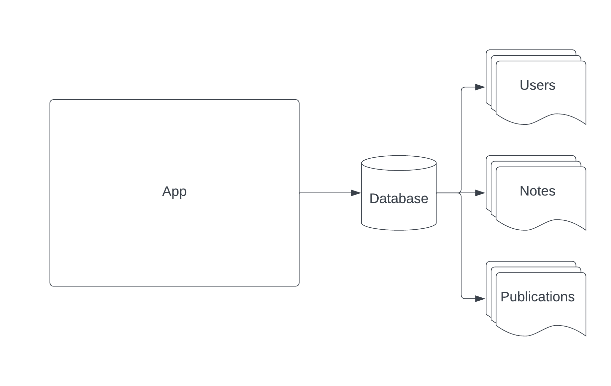

# Scaling Data Sources

## Table of Contents

<!-- START doctoc generated TOC please keep comment here to allow auto update -->
<!-- DON'T EDIT THIS SECTION, INSTEAD RE-RUN doctoc TO UPDATE -->

- [Announcements](#announcements)
- [News](#news)
- [Scaling and Performance in General](#scaling-and-performance-in-general)
- [JUG Talk Last Week - Tradeoffs in Modern Architectures](#jug-talk-last-week---tradeoffs-in-modern-architectures)
- [Scaling Data Sources](#scaling-data-sources)
- [Demo - Sharding (plus bonus Code Organization, and Fault Tolerance)](#demo---sharding-plus-bonus-code-organization-and-fault-tolerance)
  - [Code Organization](#code-organization)
  - [Fault Tolerance](#fault-tolerance)
  - [Promises](#promises)
- [Reading](#reading)

<!-- END doctoc generated TOC please keep comment here to allow auto update -->

## Announcements

- Assignment 2 is open and due in
- [HackUSU](https://www.hackusu.com/) is coming up early next month; it's a good
  opportunity to continue working on what you've been working on, and meet other
  SWEs (and business students) in Utah.
- Lucid is having a tech talk about building public APIs and developer platforms
  on February 28th in TMCB 1170 at 6:00pm. Food and drink will be provided:

> Come hear about the technical challenges of building APIs at scale. Lucid
> Software launched their Developer Platform last fall, allowing developers to
> build out custom functionality on Lucid's visual collaboration suite. We now
> need to consider how to write code that is easy to use internally, and great
> for external developers to build on top of. Whether it's taking data from an
> external system to show that in Lucidchart, building out automation in
> Lucidspark, or many other use-cases we are actively improving what we can
> support with our APIs. After diving into some of the deeper technical
> challenges of building out APIs, we'll end with perspectives from an engineer
> who transitioned into product management, who helped lead the success of our
> API launch.

## News

## Scaling and Performance in General

Before we jump into _anything_ else, I want to be clear – these are all scaling
techniques, but you may not need any of the techniques that I'm going to talk
about. These are tools I think can be useful in your toolbox for if you do run
into scaling problems, and a rough overview of them at that.

Scaling is the idea that as more users use your site, you will need more
resources in order to handle those users in a performant way. I'm going to go
over two approaches that we've already touched loosely on: today, we'll talk
about Services, and next time we'll talk about Sharding.

## JUG Talk Last Week - Tradeoffs in Modern Architectures

- BUILD MONOLITHS! Monoliths keep things simple and easy to maintain and deploy.
- Monolith vs Distributed doesn't make sense anymore – most things are
  distributed now.
- Architecture decisions should come down to two things: Functional and
  Non-Functional requirements.
- Functional Requirements are the features you want to deliver:
  - Ex: I want users to be able to track notes on my site.
- Non-Functional Requirements are how you want to deliver those things:
  - Security, Scalability, Portability, Upgradability, Configurability,
    Auditability, Traceability, Observability, Testability, Accessibility, etc.
  - These things will determine how you build what you build.
- Non-Functional Requirements tend to be mutually exclusive to a degree, so you
  should rank them by importance
  - Ex: High scalability at the same time as High performance is hard; in
    creating scale, you generally introduce additional layers and overhead,
    which add delays to completing things quickly.

## Scaling Data Sources

We'll be working in
[this document](https://lucid.app/documents/view/b832a5ff-8344-4418-a881-ae06ffe3f067)
today.

[](https://lucid.app/documents/view/b832a5ff-8344-4418-a881-ae06ffe3f067)

## Demo - Sharding (plus bonus Code Organization, and Fault Tolerance)

We'll be working out of
[this repo](https://github.com/hhenrichsen/sandbox-sharding-example).

### Code Organization

It's very easy to write code that does what it's supposed to right in its
entrypoint; a tRPC route that handles everything, or a REST endpoint that
parses, does a lookup in the database, and returns.

While that _works_, often times it's better to separate that logic out. Two
reasons for this:

1. It makes it easy to reuse that logic elsewhere; if you need to do SSR, you
   can reuse the same query and build a page off of that logic, or you can use
   that query as a building block in more complex logic.
2. It makes it easier to test that logic in isolation, or mock that logic in
   isolation. I can replace my fancy DB sharding code with a simple JSON store
   while running tests, and then I don't need to worry about running a full
   database (or more than one database) at once.

I propose a model like this:

```
📁 app
  📁 src
    📁 model -- split logic from other places in the code that make sense to share
    📁 db -- database code
      📁 repository
	    📄 userrepository.ts
	    📄 noterepository.ts
	  📄 shardmanager.ts
    📁 routes -- rest-related endpoints
      📁 middleware
        📄 authenticator.ts
      📁 user
        📄 registerhandler.ts
      📁 notes
        📄 notelisthandler.ts
        📄 notecreatehandler.ts
  📄 index.ts -- library entrypoint
  📄 app.ts -- actual app code
```

DI can be really useful here, especially with autowiring (automatically
constructing required classes, and sending them to the class' constructor). Then
you don't need to worry about manually creating these classes. We'll do a more
formal lecture on this in the future, but this has come up a couple times
recently so I wanted to touch on it here.

### Fault Tolerance

[This video on the event loop](https://www.youtube.com/watch?v=cCOL7MC4Pl0)
might be useful to review here, especially around the fault tolerance portion,
and promises are going to be used and abused in this portion.
[](https://www.youtube.com/watch?v=cCOL7MC4Pl0)

The idea with fault tolerance is that certain classes of errors are accounted
for and mitigated; for example, if I turn my database off, I want to hold any
responses for a time and see if trying again a little later will work.

### Promises

The way things used to work, we would just call a callback after some work was
completed:

```js
readFromFileSystem("myFile.txt", function (file) {
  // do something with the file
});
```

However, this quickly gets unweildy when you want to do many things one after
the other:

```js
readFromFileSystem("myFile.txt", function (file) {
  writeToFileSystem("copy.txt", file.contents, function (newFile) {
    sendOverNetwork("copy.txt", function (response) {
      // Yikes, this is a lot of nesting.
    });
  });
});
```

So that idea of a callback was abstracted into what's called a `Promise`. It
contains two things: a function to call when some work is done, and a function
to call when something goes wrong. These are normally called `resolve` and
`reject`:

```js
const myPromise = new Promise((resolve, reject) => {
  // some code to do something that takes a long time
  // ...

  resolve(result);
});

myPromise
  .then((result) => {
    // do something with the result
  })
  .catch((err) => {
    // do something to handle an error
  });
```

And syntax sugar was introduced around those to make it deal with these similar
to how normal code works, one thing after another:

```js
try {
  const result = await myPromise; // Does the same thing as above, inside the then block
} catch (err) {
  // do something to handle an error, just like the catch block above.
}
```

## Reading

None! Next time is a Q&A session. Please add questions to the form, slack them
to me, or bring them to class.
