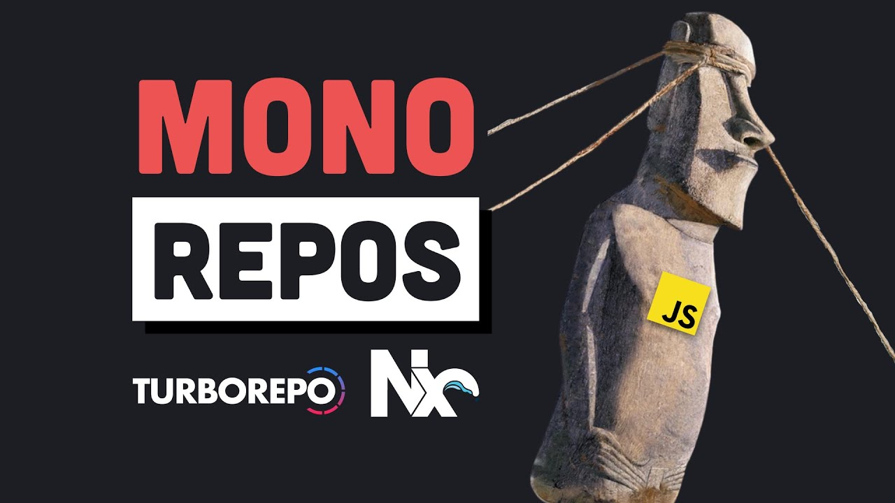

## News and Housekeeping

- I have added the first assignment to Learning Suite for meeting with me. I
  have office hours via calendly on the syllabus, or you can use the
  [link right here](https://calendly.com/hhenrichsen). If there isn't enough
  availability, I will try to make more, push the deadline, or we can work on
  getting more mentors available. That said, I encourage you to get in early. I
  am planning on having 3 meetings throughout the rest of the semester for this
  portion of grading; during the last one we will assess the app progress
  portion of your grade.
- I am considering converting my remaining zoom office hours to calendly office
  hours to make scheduling easier for everyone. Any objections?
- [Here is a form for the Q&A session](https://forms.gle/BFYvoySKPak98uEw5); if
  I see responses here that are relevant to the next lecture or are frequently
  asked for, I will do my best to include them in that lecture.
- [Here is a form for feedback](https://forms.gle/QqM3vF8ySoRE67gv8); I will do
  my best to apply what I can from here to my next lectures. I know I'm getting
  a biased response talking to people after class, so please help me be less
  biased!

## Revisiting Lecture 2 - High Level Project Overview

### Basic Architecture

If you want to view these (and a couple more) diagrams, you can do that
[here](https://lucid.app/lucidchart/d1393522-348f-45d7-8ab0-818b384bf713/view?page=0_0#)

Here is a simple example of what an app architecture might look like:


There are a couple things happening here:

1. The user is interacting with an app, either a mobile app or a web app.
2. The web app communicates to a backend via HTTP requests.
3. The backend listens for HTTP requests, makes queries to a database (in this
   case, Postgres), and returns a response to the frontend.

This has been the standard for a little while, but is definitely not the only
way to go about it. For example, you could have a MongoDB behind the backend as
well, and want to query that using GraphQL queries instead. Or you could want to
make things more performant by using a cache like Redis.

It might look something like this, once everything is set up:


I think it's worth understanding what each of the available technologies are so
that you all are aware of them and can make an informed decision (or pivot, as
needed). Let's talk about each of them, and why I chose the ones that I did last
time.

### Monorepo vs Multiple Repos

Monorepos mean storing all of your code (regardless of if it's a mobile app, a
webpage client, a server, or a machine learning model) in the same codebase.
Google switched to use a monorepo and found many benefits that are
[outlined here](https://research.google/pubs/pub45424/). Some of the advantages
listed on page 7 are:

- **Unified versioning, one source of truth;** (needing to bump package versions
  just to update child versions is messy, this saves you time needing to do that
  by versioning everything together)
- **Extensive code sharing and reuse;** (sharing and reusing existing code
  generally means moving faster)
- **Simplified dependency management;** (this makes it easy to reuse
  dependencies between apps and packages within the same repo)
- Atomic changes;
- **Large-scale refactoring;** (when you try a new idea, or otherwise realize
  that something isn't working quite right, this is an important benefit)
- Collaboration across teams;
- Flexible team boundaries and code ownership; and
- Code visibility and clear tree structure providing implicit team namespacing.

I've bolded some that may be useful to you and added my thoughts in parenthesis,
even if you aren't working in an environment with many engineers or teams.

Here are some of the tradeoffs they list on page 8:

- Tooling investments for both development and execution; (I think this makes
  sense when building your own monorepo tooling; the community has helped
  mitigate this as it has become more popular)
- Codebase complexity, including unnecessary dependencies and difficulties with
  code discovery; and (this is somewhat mitigated by having just a few engineers
  writing the code to start, but is something to consider going forward)
- Effort invested in code health.

Here is a cool video about the options available and what the point of them are
if you are interested in learning more. (thanks to Connor for sharing in Slack!)
[](https://www.youtube.com/watch?v=9iU_IE6vnJ8)

One last note from the article that I thought was pertinent:

> a monolithic codebase in no way implies monolithic software design

This by no means says that you must not build a monolithic product, either.
Maintaining many services and such takes additional effort and overhead. I
encourage you to keep a mostly monolithic model while you are getting off the
ground, and then shift things to be separated into concerns and bottlenecks when
those arise. It is very easy to get caught in the hype around microservices and
such, but those are rarely worth it from the beginning.

### Packages vs Apps
* Apps are the parts of code that actually run
* Packages are the parts of the code that are used by the apps, but are not
  run on their own.

# Lecture 3 - Intro to Backend

Backend to me is the place to start; until you have a good idea what your data
is going to look like and how you are going to interact with that data, you will
have a hard time building a relevant frontend.

There are a couple choices here to be made:

- Tech Stack (Next.js, Flask, Django, Express, etc.)
- Communication Method (REST, GraphQL, RPC, Sockets, etc.)
- Querying and Storing Data (ORM vs Raw SQL; Migrations)

Let's talk through these.

## Tech Stack

I don't have as much of a stake in this since I work with at least 3 different
tech stacks regularly:

- A Koa / Angular / Postgres / Vultr stack for some older projects of mine
- A Next.js / React / Postgres / Vercel stack for my newest projects
- A Scala / Angular / mySQL / AWS stack at work

Some other ones that I have seen are:

- A Flask / React / mySQL / AWS stack
- A Django / Flutter / mySQL / AWS stack
- A go / Vue / Google Cloud stack

Ultimately what you decide should be something that you are familiar enough with
to move quickly, or learn something new that you think will help you move
quicker than what you know. I think if you don't have a preference you probably
should be using the t3 stack which is based around Next.js and Vercel, but that
is not a requirement. I hope by this point you have picked one.

Most of these will have a backend portion, a frontend portion, a database of
some sort (or even multiple sorts), and some hosting provider at minimum.

## Communication Technologies

One of the most fundamental pieces of architecture beyond the tech stack is what
is used to communicate between clients, servers, and other servers. This is
normally somewhat related to how you store that data, since some communication
types are better with certain types of storage.

### HTTP and REST

HTTP, or Hypertext Transfer Protocol, is the protocol that the web is built on.
It's made up of verbs, like `GET`, `POST`, `PUT`, and `DELETE`. REST, or
REpresentational State Transfer, is an architecture built on top of HTTP that
dictates how resources and verbs should be constructed. For example, a RESTful
call might look like this:

```http
GET /users
```

And this might return a list of users. One implementation might look like this,
just returning a list of user IDs and allowing the client to make additional
calls for the ones they are interested in:

```json
[
  {
    "id": 1
  },
  {
    "id": 2
  },
  {
    "id": 3
  }
]
```

A better implementation might give back enough information to build an
application, avoiding
[the N+1 problem](https://restfulapi.net/rest-api-n-1-problem/), for example:

```json
[
  {
    "id": 1,
    "name": "John Doe",
    "email": "johndoe@example.com"
  }
]
```

Some libraries will also let you eagerly go and fetch portions of related
models, or you can write your own queries to do this. This can also help with
the N+1 problem, allowing you to fetch all of the data you need in one query,
both to the server, and to the database.

To mutate data, you'll use other verbs. `POST` (create without a preset ID) or
`PUT` (create _with_ a preset ID) requests are used to add data, `PATCH`
requests are used to update data, and `DELETE` requests are used to delete data.
Most requests other than `GET` requests will allow you to send data in the body
of the request, like this:

```http
POST /auth/login
{
    "username": "hunter",
    "password": "hunter2"
}
```

Some APIs communicate with other data types, like XML:

```xml
<users>
  <user>
    <id>1</id>
    <name>John Doe</name>
    <email>johndoe@example.com</email>
  </user>
</users>
```

And there are other, less frequent data types as well, like binary data.

You might run into cases where it makes sense to only have specific fields, and
many APIs will implement this by allowing you to specify the fields you want in
the query string, like this:

```http
GET /users?fields=id,name
```

You might implement this in your database like this:

```sql
SELECT id, name FROM users;
```

Or in an ORM like Prisma like this:

```ts
prisma.user.findMany({
  select: {
    id: true,
    name: true,
  },
});
```

You probably should not just pass these as raw strings to your database, as this
can open you up to SQL injection attacks. Instead, you should use a library or
ensure that you are sanitizing your inputs, or at least making sure that the
fields being requested are safe ones.

Implementing this can save you on bandwidth, but if you find yourself filtering
very frequently, you might be better off with the next type of communication,
GraphQL.

### GraphQL

GraphQL allows you to query just the data you want from a server. That means
it's a lot more flexible for unstructured data, but it means that if you are
using a structured data source (like a SQL database), you will need to do
complex queries to get the data you want.

That means that when using GraphQL, you might want to consider using a document
data store like MongoDB and expose the entire documents to the GraphQL server,
or use a graph database like Neo4j.

GraphQL queries look like this:

```graphql
query {
  users {
    id
    name
    email
  }
}
```

Some servers will allow you to make the request as a query, especially when
serving the GraphQL server over HTTP:

```http
/query?={users{id,name,email}}
```

To modify data, GraphQL uses mutations that are a little bit like stored
procedures in a database; you give parameters to a preset mutation, and then can
execute that mutation:

```graphql
mutation CreateUser($name: String, $email: String) {
  # this is the data you are using to create the user
  createUser(name: $name, email: $email) {
    # and this is the data you are querying back
    id
    name
    email
  }
}
```

GraphQL is largely built around having a published schema, which can result in
some really good developer experience, especially if you want to convince people
to build against your platform.

GraphQL shares some with tRPC since the schema is public and typesafe; having
both of those benefits baked into your API makes the experience of developing on
it both really fast and really easy. Things like Swagger can bring this to a
REST API if you have gone that route, but the other two methods on top of HTTP
have that automatically.

### RPC and tRPC

RPC stands for Remote Procedure Call. It's a generic framework for describing
how a client (even if that client is a server itself) should talk to a server
(or in other words, a remote), triggering some code execution on that server, or
in other words a procedure call. A popular implementation is `gRPC` which is
Google's implementation, and has been used fairly broadly, especially when
servers are talking to other servers.

tRPC is a recent entry, but a really cool way to work quickly with schema
changes and such. It's built on top of HTTP, so it still uses the same verbs
under the hood, but takes the same structure.

It allows you to sync your schema between clients and servers, including the
type information and automatic validation. Last time I mentioned in my notes
about what creating a schema looks like; that can be found [here](./Lecture 2 -
Project Setup.md#Communicating between Server and Client with tRPC).

I have opted to use this since it's a lot more straightforward than creating
routers, dealing with requests, etc., when the main thing I care about is
writing the actual procedures and logic. The other two generally either require
boilerplate, or require knowing about the right niche technology that can turn a
database into a REST API or a GraphQL server.

### Honorable Mentions - Sockets

Sockets are a rather complicated way to communicate between a client and a
server, but the benefit is that they are real time. That means that you can send
data from the server to the client without the client having to request it. This
is useful for things like chat applications, or applications that need to update
in real time, like a stock ticker.

### Summary

| Communication Type | Description                                | Storage Type                                  |
| ------------------ | ------------------------------------------ | --------------------------------------------- |
| HTTP and Rest      | Simple verbs to get and manipulate data    | Relational DB (mySQL, PostgreSQL)             |
| GraphQL            | A published schema that can be queried     | Document DB (MongoDB), Graph Database (Neo4j) |
| tRPC               | A set of procedures to get and mutate data | Relational DB                                 |
| Sockets            | Realtime communication with a server       | Application State, Redis                      |

## ORMs and Queries

ORMs are pretty divisive, and I think these are worth a read. Some of them are
more biased than others:

- [Enterprise Craftsmanship: Do you need an ORM?](https://enterprisecraftsmanship.com/posts/do-you-need-an-orm/)
- [Dev.to / @harshhhdev: Why ORMs aren't always a good idea](https://dev.to/harshhhdev/why-orms-arent-always-a-great-idea-41kg)
- [Logrocket: Node.js ORMs: Why you shouldn’t use them](https://blog.logrocket.com/node-js-orms-why-shouldnt-use/)
- [Bohzo's Tech Blog: ORM Haters Don’t Get It](https://techblog.bozho.net/orm-haters-dont-get-it/)

Ultimately, how you get data out of your data store is up to you. I find having
a layer on top of the data that lets me manipulate the data is useful (even when
using MongoDB or other NoSQL data stores), especially when I can use the same
mapping to generate database queries and migrations (mainly for relational data
stores). However, that does not need apply to every project, and some may be
more performant or flexible just using queries on whatever storage method you
chose.

ORMs tend to be a place where you get a decent amount of choice regardless of
stack. Javascript is approaching 10 available ORMs at the time of writing, and
many of them (TypeORM, Drizzle, Prisma) have pretty popular adoption.

I like Primsa because it gives me type safe queries, and lets me move quickly in
development using the push command, while still keeping me safe in production
using migrations.

## Demo: Adding a REST Route to my Next.js App

First, I'm going to add a file to the `pages/api` folder called `xml.tsx`:

`xml.tsx`

```tsx
import { NextApiRequest, NextApiResponse } from "next";
import { prisma } from "db/lib/prisma";

export default async (req: NextApiRequest, res: NextApiResponse<string>) => {
  const postList = await prisma.post.findMany();

  const postXml = postList.map(
    (post) => `<post>
        <title>${post.title}</title>
        <content>${post.content}</content>
        <likes>${post.likes}</likes> 
    </post>`,
  );

  res.setHeader("Content-Type", "text/xml").status(200)
    .send(`<?xml version="1.0" encoding="UTF-8"?>
    <posts>
      ${postXml.join("\n")}
    </posts>`);
};
```

If I wanted to implement some of the filtering I mentioned before, here is how I
would do that:

```tsx
import { NextApiRequest, NextApiResponse } from "next";
import { prisma } from "db/lib/prisma";

const AllowedFields = new Set(["title", "content", "likes"]);

export default async (req: NextApiRequest, res: NextApiResponse<string>) => {
  const filter = req.query["filter"];
  const parts = typeof filter == "string" ? filter.split(",") : filter;
  const selectFields = parts?.reduce((acc, curr) => {
    // Don't allow fields that I haven't explicitly
    // allowed into the select statement.
    if (AllowedFields.has(curr)) {
      acc[curr] = true;
    }
    return acc;
  }, {});
  // Ensure that we are actually selecting something,
  // otherwise select everything.
  const select =
    selectFields && Object.keys(selectFields).length > 0
      ? selectFields
      : undefined;

  const postList = await prisma.post.findMany({ select });

  const postXml = postList
    .map((post) =>
      // This is a clever way to deal with the {} type,
      // but it would probably be better to use a dedicated
      // library for converting a JS Object to XML.
      Object.entries(post)
        .map(([key, value]) => `<${key}>${value}</${key}>`)
        .join("\n"),
    )
    .map((post) => `<post>${post.trim()}</post>`);

  res.setHeader("Content-Type", "text/xml").status(200)
    .send(`<?xml version="1.0" encoding="UTF-8"?>
    <posts>
      ${postXml.join("\n")}
    </posts>`);
};
```

I think that this is much cleaner using an external library for filtering, but
this goes to show how it might still be a straightforward change to allow simple
things to come through the request (and shows you how you might deal with things
coming from the query parameters, too).

[Here](https://github.com/koajs/json-filter) is an example from the koa
ecosystem that does just that on a response level.
