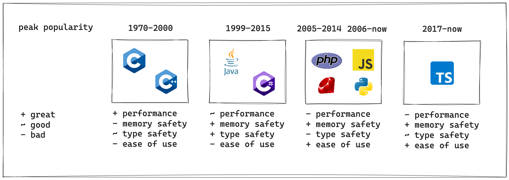

# Why TypeScript?

Programming languages, paradigms, and technologies have fluctuated in popularity
throughout the history of computers as we've experimented with different ways to
solve problems. We've been able to see the pros and cons of certain decisions
and slowly move towards better solutions.

TypeScript might not be the best solution but it does well in a lot of key areas
and technologies have advanced to help smooth out the rough edges. TypeScript
transpiles to JavaScript so much of the success of TypeScript can be attributed
to the success of JavaScript. TypeScript can attribute much of its popularity to
a few things such as being a browser native language, Node.js, its type system,
and its easy syntax.

Many tools and technologies have made TypeScript an easy and versatile language
such as frontend frameworks like React, deployment solutions like Vercel,
backend frameworks like Next.js, and the millions of other libraries and tools
that make common tasks easy to accomplish.

Other languages might be technically better (better error handling, more
performant, better type system, more control, more context, etc.), but
TypeScript is most likely better when you take into account the entire
ecosystem. There are so many libraries and tools, but there are also so many
people to hire from. Your biggest cost as a tech company is going to be human
capital. TypeScript is one of the best languages out there to help optimize for
that.
